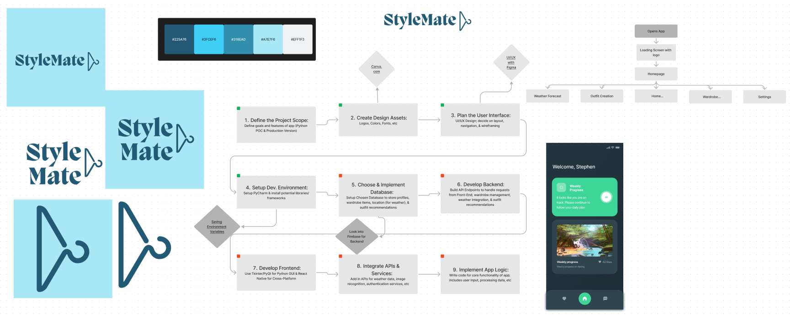

# StyleMate-Python
StyleMate is an app that helps you pick outfits with ease. After inputing your entire wardrobe, and receiving daily weather forecasts, StyleMate can recommend you outfits to wear every day of the week.

## Why Python?
To build a proof of concept (POC) for StyleMate, this version was created to demostrate the basic functions used in the real app. 

## Project Stack:
- Language => Python
- GUI => Tkinter
- APIs => Axios/RapidAPI

## Phase 1 Project Goals: ⭐
- Build Stamina in Python Coding
- Learn how to build good GUIs with Tkinter
- Build App Structure with Blank Pages (Will add "outline" for pages)

## Phase 2 Project Goals:
- Finish All Page Screens with Complete Designs
- Connect Weather API to get real forecasts
- Learn how to use upload buttons with Python
- Connect Wardrobe Management with Firebase

## Phase 3 Project Goals
- Create an outfit planning algorithm to pick outfits based on weather and style
- Learn how to use Neural Networks with Python

## Phase 4 Project Goals & Beyond
- Learn how to build project for multiple users
- Migrate to React GUI and brush up on JavaScript

## Future App Features:
- Request & Display Weather for entire week in app
- Be able to input clothes as images, text, and keywords
    - Wiil just input images from pc and not photo app as POC
- Use an aesthetic UI that may be simpler than mobile version of app
- Simply reccoomend clothes based on temp. and clothing type
    - If hot, wear t-shirt
    - if cold, wear hoodie
- For each clothiing item, include type, color, size, & attribute (comfort, style, etc)

## Project Graphics/Screenshots

### App Design Reference

### App Development Process + Logos
